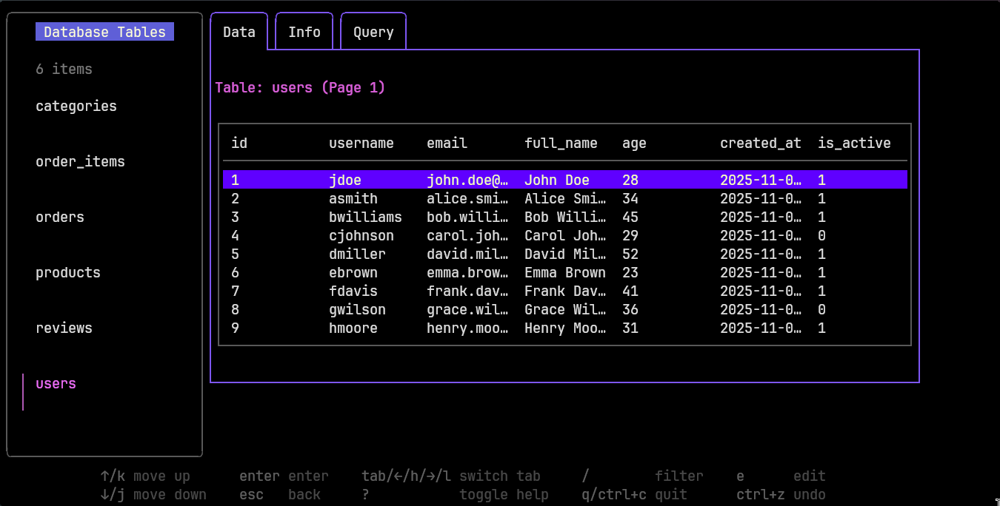

# dbtui
SQLite database manager in your terminal

This is a solo project submitted to BCIT HTTPHacks 2025 Hackathon

Best used with a terminal font <= 14 and fullscreen



## Dependencies

- go 1.25.3
- make (*optional building with make)
- (sqlite does not need to be installed)

## Quickstart

```sh
git clone https://github.com/kvnbanunu/dbtui.git
cd dbtui
go run main.go -seed ./sqlite.db
```


## Features

Completed Features
- View tables
- Edit rows
- Seed test data
- Execute custom queries

Planned Features
- Add new tables/columns/rows
- Delete tables/columns/rows

## Usage

This program has only been tested on Linux

Option 1 Build from source

```sh
git clone https://github.com/kvnbanunu/dbtui.git
cd dbtui

make build
or
go build main.go -o <BUILD PATH>/dbtui

cd <BUILD PATH>
./dbtui [OPTIONS] <DB PATH>
```

---

Option 2 Run without building

```sh
git clone https://github.com/kvnbanunu/dbtui.git
cd dbtui

go run main.go [OPTIONS] <DB PATH>
```

---

Option 3 Install to GO bin

```sh
go install github.com/kvnbanunu/dbtui

dbtui [OPTIONS] <DB PATH>
```

## Options

- [-h] Displays a help message
- [-seed] Seeds database with test data

## Controls

Global
- quit: ctrl-c/q
- help: ?

List View
- move up: ↑/k
- move down: ↓/j
- filter: /
- select row: Enter

Table View
- switch tabs: ←/h →/l tab
- move up: ↑/k
- move down: ↓/j
- edit row: e (Data tab only)
- back to List View: esc

Query View
- run query: Enter
- reset: ctrl-z

Row Edit Form
- move down: Enter
- move up: shift+tab
- submit: y (must be at the bottom of the form)
