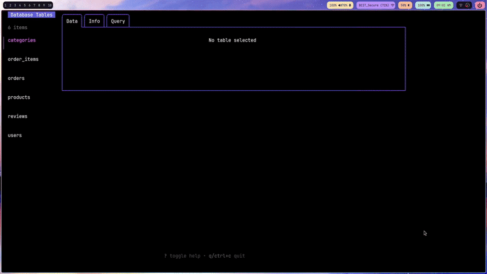

# dbtui
SQLite database manager in your terminal

## Dependencies

- go 1.25.3
- make (*optional building with make)

## Quickstart

```sh
git clone https://github.com/kvnbanunu/dbtui.git
cd dbtui
go run main.go -seed ./sqlite.db
```


## Usage

Option 1 Build from source

```sh
git clone https://github.com/kvnbanunu/dbtui.git
cd dbtui

make build
or
go build main.go -o <BUILD PATH>/dbtui

cd <BUILD PATH>
./dbtui [OPTIONS] <DB PATH>
```

---

Option 2 Run without building

```sh
git clone https://github.com/kvnbanunu/dbtui.git
cd dbtui

go run main.go [OPTIONS] <DB PATH>
```

---

Option 3 Install to GO bin

```sh
go install github.com/kvnbanunu/dbtui

dbtui [OPTIONS] <DB PATH>
```

## Options

- [-h] Displays a help message
- [-seed] Seeds database with test data
